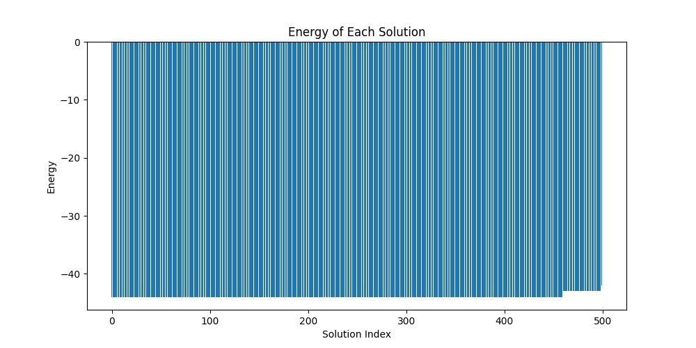
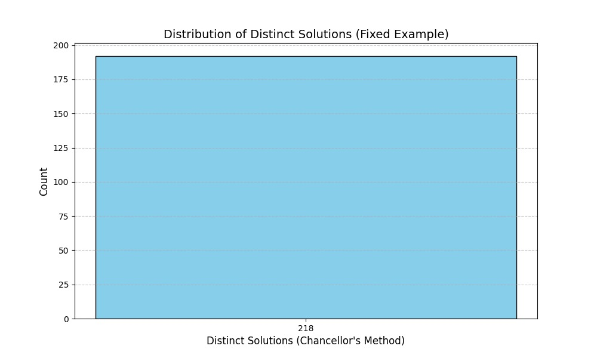
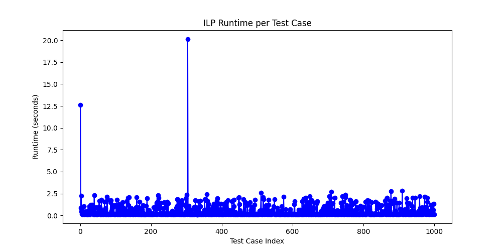

# SitSatSat 🌟

This project explores the use of **Quantum Annealing** to solve the classic **3SAT** problem. The aim is to maximize the number of satisfied clauses in a given **Boolean formula** using **D-Wave's quantum annealer** (via their Ocean SDK) and **SimulatedAnnealingSampler** for optimization.

🎯 **Project Goal**: Solve 3SAT instances with quantum annealing techniques and the classical approach to optimize the truth assignments that maximize the number of satisfied clauses and finally compare between the runtime and accuracy of both techniques

---

## 📚 Table of Contents

- [Project Overview](#project-overview)
- [Installation & Setup](#installation--setup)
- [Usage Instructions](#usage-instructions)
- [How It Works](#how-it-works)
- [Results and Analysis](#results-and-analysis)
- [Visualization of Results](#visualization-of-results)
- [License](#license)
- [Acknowledgments](#acknowledgments)

---

## 💡 Project Overview

### Project Description:
- **Objective**: Solve the **3SAT** problem using **quantum annealing** and **optimization** techniques.
- **Key Libraries**: **dimod**, **Pulp**, **matplotlib**, **time**, **glob**.

### Features:
- Maximize the number of satisfied clauses in a 3SAT problem.
- Use quantum computing to solve **NP-complete** problems in an efficient manner.

### Expected Results:
- **Optimal Assignment**: The solution that satisfies the maximum number of clauses.
- **Energy Calculation**: The "energy" of each configuration.
- **Visual Data**: Insights into the solution process and results.

---

## 🛠️ Installation & Setup

### Prerequisites:
Before running the project, make sure you have the following installed:
- **Python 3.x**
- Required libraries: `dimod`, `dwave-ocean-sdk`, `Pulp`, `matplotlib`, `time`, `glob`

### Installation Steps:

1. **Clone the Repository**:
    ```bash
    git clone https://github.com/marcelinoSamer/SitSatSat
    cd SitSatSat
    ```

2. **Install Dependencies**:
    ```bash
    pip install dimod
    pip install pulp
    pip install matplotlib
    ```

3. **Create a D-Wave Account**:
   - Go to [D-Wave Leap](https://cloud.dwavesys.com/leap/) and sign up.
   - Obtain your **API token** from the D-Wave console.
   - **Note:** Though this step is crucial for accessing a real quantum annealer, we were unable of accessing it due to location limitation and sticked with the quantum annealing simulator `dimod`

4. **Set Up Your API Token**:
    ```bash
    export DWAVE_API_TOKEN="your-api-token"
    ```

---

## 🚀 Usage Instructions

### Prepare the 3SAT Formula:
- **Input Format**: The program accepts files of extension `.cnf` as input. The code reads each file as a test case from the folder `\test_cases\`

### Running the Code:
1. Navigate to the project folder in the terminal.
2. Run the either the classical or the quantum script to solve the 3SAT problem:
    ```bash
    python classical/classical.py
    python quantum/quantum.py
    ```

3. The output will include:
    - The optimal binary assignments for the variables.
    - The total number of satisfied clauses.
    - Visualization results.

---

## 🔍 How It Works

### Problem Transformation:
1. Convert the **3SAT problem** to a **QUBO model**.
2. Define a **quadratic objective function** based on the Boolean formula.
3. Assign a binary variable for each clause in the formula.

### Quantum Annealing Optimization:
- **Optimization Goal**: Find the assignment of binary variables that maximizes the number of satisfied clauses.
- **Quantum Annealing** is used to explore the solution space and search for an optimal solution.

### Classical vs. Quantum Optimization:
- While classical methods involve exhaustive search, quantum annealing uses probabilistic techniques for faster exploration of the solution space.

---

## 📊 Results and Analysis

### Example 1: Small 3SAT Instance
- **Formula**: `(x1 OR x2 OR NOT x3) AND (NOT x1 OR x3 OR x4)`
- **Variables**: 4
- **Clauses**: 2
- **Maximum Clauses Satisfied**: 2

### Example 2: Larger 3SAT Instance
- **Formula**: `((x1 OR x2 OR x3) AND (NOT x2 OR x3 OR x4) AND (x4 OR x5 OR NOT x1))`
- **Variables**: 5
- **Clauses**: 3
- **Maximum Clauses Satisfied**: 3

### Performance:
- **Time Taken**: The classical approach performed better in our testing face, this was due to the inability to access **real quantum hardware**.
- **Energy Calculations**: The Quantum annealer found the lowest energy during solving and outputted the corresponding variable truth values.
---

## 💡 Visualization of Results

### Energy of Solutions:


### Variable Assignment Frequency:


## Runtime for the classical approach:



---

## 📝 License

This project is licensed under the **MIT License**. See the [LICENSE](LICENSE) file for more details.

---

## 🌟 Acknowledgments

- **D-Wave Systems**: Thanks for providing the quantum hardware and access to their Leap platform.
- This project was part of the **Quantum Computing Contest 2025**.

---

### 💬 Questions or Feedback?

If you have any questions, suggestions, or issues, feel free to [open an issue](https://github.com/marcelinoSsmer/SitSatSat/issues) on GitHub.

---

**Happy Coding and Quantum Computing!** ✨
